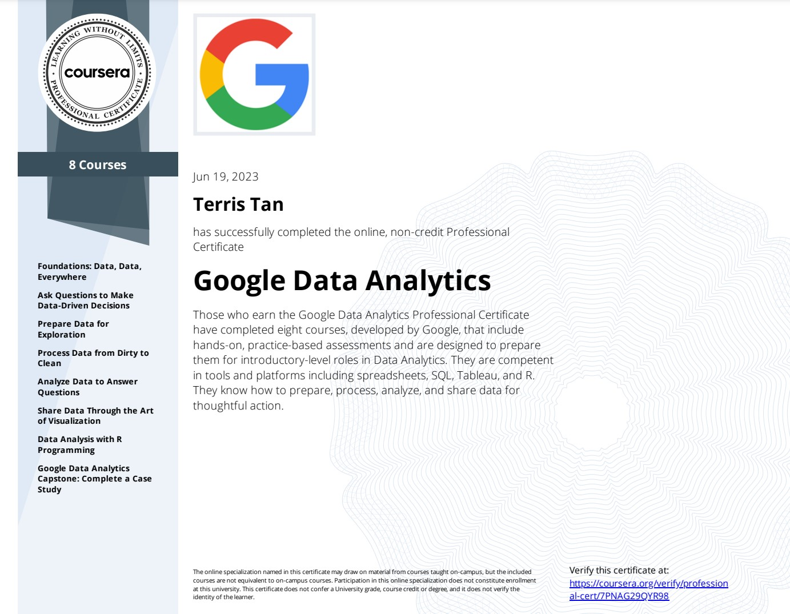

## [Google Data Analytics Professional Certificate](https://www.coursera.org/professional-certificates/google-data-analytics)

 

 

### About this Professional Certificate

Prepare for a new career in the high-growth field of data analytics, no experience or degree required. Get professional training designed by Google and have the opportunity to connect with top employers. **There are 483,000 open jobs in data analytics with a median entry-level salary of $92,000.**

**Data analytics** is the collection, transformation, and organization of data in order to draw conclusions, make predictions, and drive informed decision making.

Over 8 courses, gain in-demand skills that prepare you for an entry-level job. You’ll learn from Google employees whose foundations in data analytics served as launchpads for their own careers. At under 10 hours per week, you can complete the certificate in less than 6 months.

Upon completion, you can directly apply for jobs with Google and over 150 U.S. employers, including Deloitte, Target, Verizon, and of course, Google.

**75% of certificate graduates report a positive career outcome (e.g., new job, promotion, or raise) within six months of completion**

 

## **Applied Learning Project**

This program includes over 180 hours of instruction and hundreds of practice-based assessments, which will help you simulate real-world data analytics scenarios that are critical for success in the workplace. The content is highly interactive and exclusively developed by Google employees with decades of experience in data analytics. Through a mix of videos, assessments, and hands-on labs, you’ll get introduced to analysis tools and platforms and key analytical skills required for an entry-level job.

**Skills you’ll gain will include:** Data cleaning, problem solving, critical thinking, data ethics, and data visualization

**Platforms and tools you will learn include:** Presentations, Spreadsheets, SQL, Tableau and R Programming

In addition to expert training and hands-on projects, you'll complete a case study that you can share with potential employers to showcase your new skill set. Learn concrete skills that top employers are hiring for right now.
